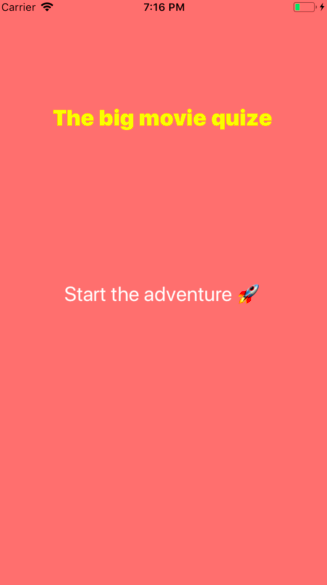

# Emovis 🎬

### Summery

Hi there! 👋

This is my very first project **in Swift** which I made **fully on my own**.

It is a movie guess game where you have to figure out the movie titles and only emojis are provided. 

Go ahead and gather as many points as you can! 👀

### What did I learn? 👩🏻‍💻

- Since it was my first very own project I learned how to **build up an app from scratch**.

- How to **randomly change the background color** of the view.

- How to **add sound effect** when buttons are tapped.

- Created **my own function** which gives you back 10 random elements from an array.

- Although it is fairly a simple application I still did **lots of lots of research** about different topics where I needed deeper knowledge to solve problems. 

- I learned **how to search**, which sources are useful in general and how to **decide quickly** if a code snippet is relevant for my project. 

+ Bonus knowledge: Now I know how to write down dozens of movies only with emojis. (Of course this is also quite important...)🎉

### How does it work? 🧐

*Well it is pretty easy just follow these steps:*

1. Click on the "Start Adventure button". 🚀

2. Guess your first movie. 

3. Type in your answer (be careful don't use underscore: "_").

4. Click on the return/ check button or basically anywhere on the sreen.

5. The background turns to green and you will hear cheering sound effect if your answer is correct. You already earned **+10 points**. (Don't worry if you did't get it, the right answer will be shown!)

6. Click on the next button to see your next task.

7. If you don't have a clue you can click on the skip button which will bring you right to the next movie. But your reward will be 0 point. 

8. After you guessed 10 moview the game is over. You can see your total points on the sreen. 🏆

9. Go ahead and **test your knowledge again**. 🎯

*This is how the app looks like when you first open it.*

*This is how the app looks like when have to type in your answer.*

*This is how the app looks like when your answer is correct. 👑*

*This is how the app looks like when your answer is NOT correct. 😿*

*And this is how to play like an expert. 💃*

